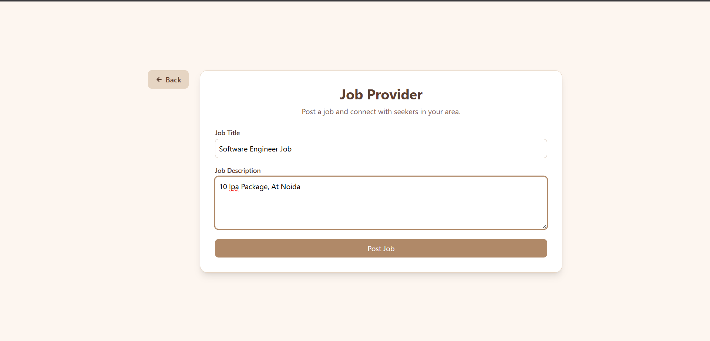
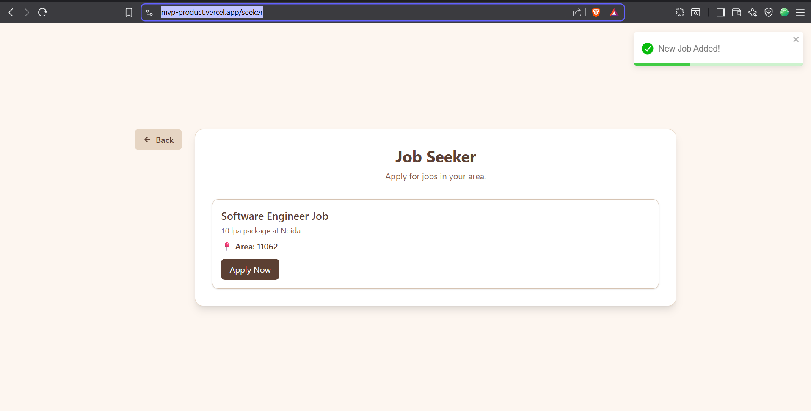
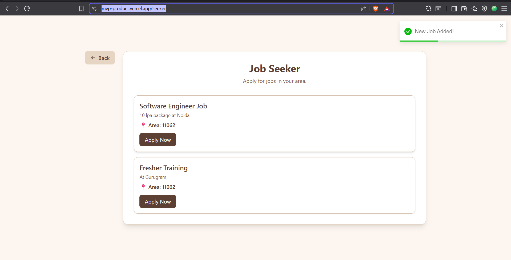

# 🧑‍💼 Find/Post Job App  

A real-time job portal where **Job Providers** can post jobs and **Job Seekers** can browse and apply for jobs in their area.  
The app uses **Socket.io** for real-time updates between providers and seekers.  

🔗 **Live Demo:** [Find/Post Job App](https://mvp-product.vercel.app)  
- **Frontend:** Vite + React (Deployed on Vercel)  
- **Backend:** Node.js + Socket.io (Deployed on Render)  

---

## 🚀 Features  

- 👤 **Job Provider**: Post new jobs instantly.  
- 🔎 **Job Seeker**: Browse and apply for jobs in real-time.  
- ⚡ **Real-time Updates**: Powered by **Socket.io**.  
- 🎨 Clean and modern UI with smooth interactions.  

---

## 📸 Screenshots  

### Welcome Page  
  

### Job Provider – Post a Job  
  
  
  

### Job Seeker – Browse Jobs  
  
  
  

---

## 🛠️ Tech Stack  

**Frontend**  
- Vite + React  
- TailwindCSS  

**Backend**  
- Node.js  
- Express  
- Socket.io  

**Deployment**  
- Frontend → Vercel  
- Backend → Render  

---

## ⚙️ Setup Instructions  

### 1. Clone the repo  
```bash
git clone https://github.com/AfifaFatima786/MVP-Product.git
```

### 2. Install dependencies  
#### Frontend  
```bash
cd frontend
npm install
npm run dev
```

#### Backend  
```bash
cd backend
npm install
npm start
```
